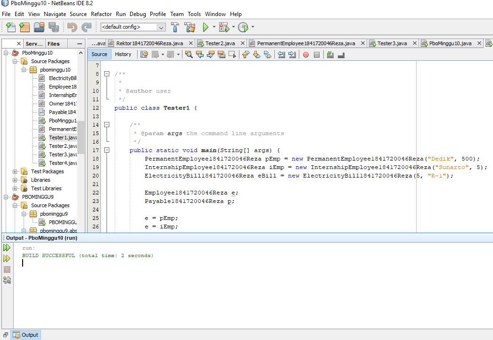
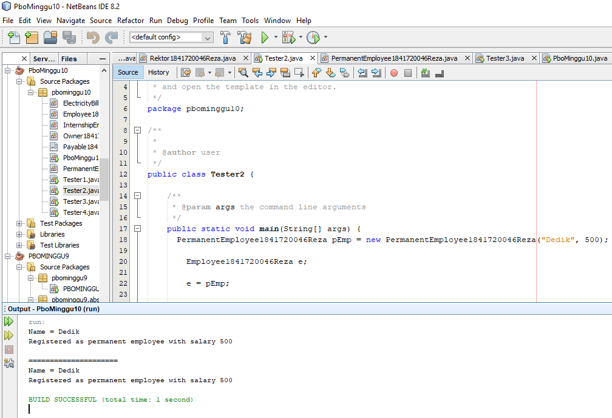
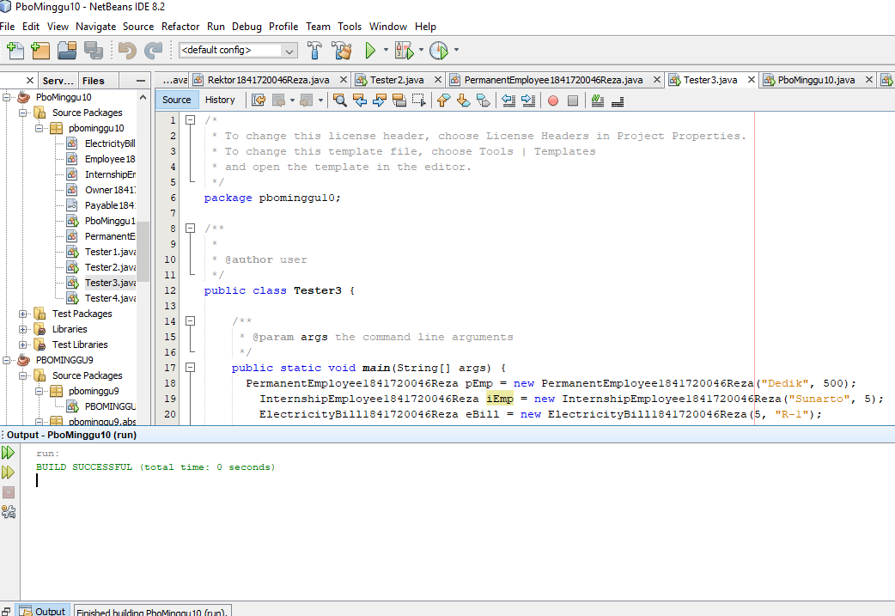
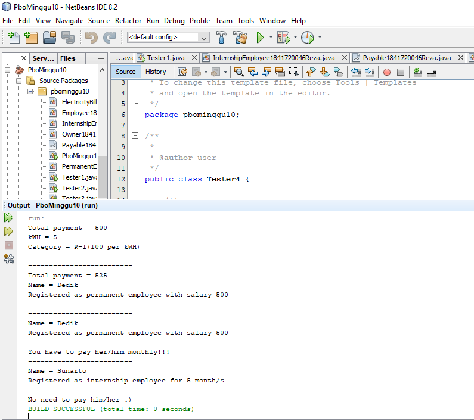

# Laporan Praktikum #10 - Polimorfisme

## Kompetensi

Setelah melakukan percobaan pada jobsheet ini, diharapkan mahasiswa mampu:

a.    Memahami konsep dan bentuk dasar polimorfisme

b.    Memahami konsep virtual method invication

c.    Menerapkan polimorfisme pada pembuatan heterogeneous collection

d.    Menerapkan polimorfisme pada parameter/argument method

e.    Menerapkan object casting untuk meng-ubah bentuk objek

## Ringkasan Materi

- Polimorfisme merupakan kemampuan suatu objek untuk memiliki banyak bentuk. Penggunaan polimorfisme yang paling umum dalam OOP terjadi ketika ada referensi super class yang digunakan untuk merujuk ke objek dari sub class. Dengan kata lain, ketika ada suatu objek yang dideklarasikan dari super class, maka objek tersebut bisa diinstansiasi sebagai objek dari sub class. 

- Virtual method invocation terjadi ketika ada pemanggilan overriding method dari suatu objek polimorfisme. Disebut virtual karena antara method yang dikenali oleh compiler dan method yang dijalankan oleh JVM berbeda.

- Dengan adanya konsep polimorfisme, maka variabel array bisa dibuat heterogen. Artinya di dalam array tersebut bisa berisi berbagai macam objek yang berbeda. 

- Polimorfisme juga bisa diterapkan pada argument suatu method. Tujuannya agar method tersebut bisa menerima nilai argument dari berbagai bentuk objek.

- Operator instanceof bisa digunakan untuk mengecek apakah suatu objek merupakan hasil instansiasi dari suatu class tertentu.

- Casting objek digunakan untuk mengubah tipe dari suatu objek. Jika ada suatu objek dari subclass kemudian tipenya diubah ke superclass, maka hal ini termasuk ke upcasting. 

## Percobaan

### Percobaan 1

- Class Employee1841720046Reza.java

Link kode program : [Employee1841720046Reza.java](../../src/10_Polimorfisme/Employee1841720046Reza.java)

- Class Payable1841720046Reza.java

Link kode program : [Payable1841720046Reza.java](../../src/10_Polimorfisme/Payable1841720046Reza.java)

- Class 
InternshipEmployee1841720046Reza.java 

Link kode program : [InternshipEmployee1841720046Reza.java](../../src/10_Polimorfisme/InternshipEmployee1841720046Reza.java)

-Class
PermanentEmployee1841720046Reza.java

Link kode program : [PermanentEmployee1841720046Reza.java](../../src/10_Polimorfisme/PermanentEmployee1841720046Reza.java)

- Class ElectricityBill1841720046Reza.java

Link kode program : [ElectricityBill1841720046Reza.java](../../src/10_Polimorfisme/ElectricityBill1841720046Reza.java)

-Main Class,Tester1.java

Link kode program : [Tester1.java](../../src/10_Polimorfisme/Tester1.java)

## Pertanyaan Percobaan 1

1.    Class apa sajakah yang merupakan turunan dari class Employee?
- InternshipEmployee1841720046Reza 

2.    Class apa sajakah yang implements ke interface Payable?
- PermanentEmployee1841720046Reza

3.    Perhatikan class Tester1, baris ke-10 dan 11. Mengapa e, bisa diisi dengan objek pEmp (merupakan objek dari class PermanentEmployee) dan objek iEmp (merupakan objek dari class
InternshipEmploye) ?
- Karena keduanya sama – sama turunan dari class Employee1841720046Reza

4.    Perhatikan class Tester1, baris ke-12 dan 13. Mengapa p, bisa diisi dengan objek pEmp(merupakan objek dari class PermanentEmployee) dan objek eBill  (merupakan objek dari class ElectricityBill) ?
- Karena keduanya sama – sama mengimplementasikan interface Payable1841720046Reza 

5.    Coba tambahkan sintaks:

p = iEmp;
e = eBill;

pada baris 14 dan 15 (baris terakhir dalam method main) ! Apa yang menyebabkan error?

6.    Ambil kesimpulan tentang konsep/bentuk dasar polimorfisme!
- Polimorfisme dapat diartikan sebagai sesuatu yang memiliki banyak bentuk

### Percobaan 2
- Main Class,Tester2

Link kode program : [Tester2.java](../../src/10_Polimorfisme/Tester2.java)

1.    Perhatikan class Tester2 di atas, mengapa   pemanggilan e.getEmployeeInfo() pada baris 8 dan pEmp.getEmployeeInfo() pada baris 10 menghasilkan hasil sama?

- Karena  e dan pEmp sama – sama instan

2.    Mengapa pemanggilan method e.getEmployeeInfo() disebut sebagai pemanggilan method virtual (virtual method invication), sedangkan pEmp.getEmployeeInfo() tidak?

3.    Jadi apakah yang dimaksud dari virtual method invocation? Mengapa disebut virtual?

- Virtual method invocation terjadi ketika ada pemanggilan overriding method dari suatu objek polimorfisme.

### Percobaan 3

- Main Class,Tester3

Link kode program : [Tester3.java](../../src/10_Polimorfisme/Tester3.java)

## Pertanyaan Percobaan 3

1.    Perhatikan array e pada baris ke-8, mengapa ia bisa diisi dengan objek-objek dengan tipe yang berbeda, yaitu objek pEmp (objek dari PermanentEmployee) dan objek iEmp (objek dari InternshipEmployee) ?
- Karena keduanya sama – sama turunan dari class Employee1841720046Reza

2.    Perhatikan juga baris ke-9, mengapa array p juga biisi dengan objek-objek dengan tipe yang berbeda, yaitu objek pEmp (objek dari
PermanentEmployee) dan objek eBill (objek dari ElectricityBilling) ?
- Karena keduanya sama – sama mengimplementasikan interface Payable1841720046Reza
3.    Perhatikan baris ke-10, mengapa terjadi error?
- Karena eBill bukan merupakan turunan dari class Employee1841720046Reza

### Percobaan 4

Class Owner1841720046Reza.java

Link kode program : [Owner1841720046Reza.java](../../src/10_Polimorfisme/Owner1841720046Reza.java)

- Main Class,Tester4
Link kode program : [Tester4.java](../../src/10_Polimorfisme/Tester4.java)

## Pertanyaan Percobaan 4

1.    Perhatikan class Tester4 baris ke-7 dan baris ke-11, mengapa pemanggilan ow.pay(eBill) dan ow.pay(pEmp) bisa dilakukan, padahal jika diperhatikan method pay() yang ada di dalam class Owner memiliki    argument/parameter bertipe Payable? Jika diperhatikan lebih detil    eBill merupakan    objek dari ElectricityBill    dan    pEmp merupakan objek dari PermanentEmployee?
- Karena keduanya sama – sama mengimplementasikan interface Payable1841720046Reza

2.    Jadi apakah tujuan membuat argument bertipe Payable pada method pay() yang ada di dalam class Owner?
- Untuk memanggil method 

3.    Coba pada baris terakhir method main() yang ada di dalam class Tester4 ditambahkan perintah ow.pay(iEmp);

4.    Perhatikan class Owner, diperlukan untuk apakah sintaks p instanceof ElectricityBill pada baris ke-6 ?
- Untuk mengecek apakah objek yang dimasukkan sebagai parameter adalah sebuah instan dari class ElectricityBill1841720046Reza

5.    Perhatikan kembali class Owner baris ke-7, untuk apakah casting objek disana (ElectricityBill eb = (ElectricityBill) p) diperlukan
 ? Mengapa objek p yang bertipe Payable harus di-casting ke dalam objek eb yang bertipe ElectricityBill ?
 - Untuk dikembalikan ke Instan sesungguhnya sehingga dapat memanggil method 

 ### Tugas
 - Class Destroyable.java

Link kode program : [Destroyable.java](../../src/10_Polimorfisme/Destroyable.java)

- Class Zombie.java

Link kode program : [Zombie.java](../../src/10_Polimorfisme/Zombie.java)

- Class Barrier.java

Link kode program : [Barrier.java](../../src/10_Polimorfisme/Barrier.java)

- Class WalkingZombie.java

Link kode program : [WalkingZombie.java](../../src/10_Polimorfisme/WalkingZombie.java)

- Class JumpingZombie

Link kode program : [JumpingZombie.java](../../src/10_Polimorfisme/JumpingZombie.java)

- Class Plant.java
Link kode program : [Plant.java](../../src/10_Polimorfisme/Plant.java)

- Main Class,Tester.java
Link kode program : [Tester.java](../../src/10_Polimorfisme/Tester.java)

## Kesimpulan

- Kita dapat memahami konsep dan bentuk dasar polimorfisme

- Kita dapat memahami konsep virtual method invication

- Kita dapat menerapkan polimorfisme pada pembuatan heterogeneous collection

## Pernyataan Diri

Saya menyatakan isi tugas, kode program, dan laporan praktikum ini dibuat oleh saya sendiri. Saya tidak melakukan plagiasi, kecurangan, menyalin/menggandakan milik orang lain.

Jika saya melakukan plagiasi, kecurangan, atau melanggar hak kekayaan intelektual, saya siap untuk mendapat sanksi atau hukuman sesuai peraturan perundang-undangan yang berlaku.

Ttd,

*(Maulana Reza Pratama*