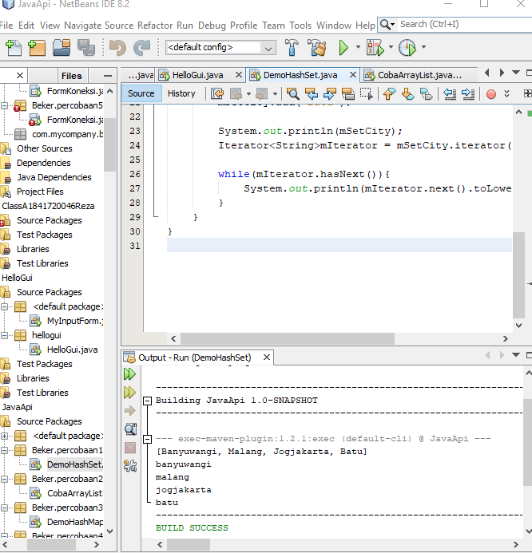
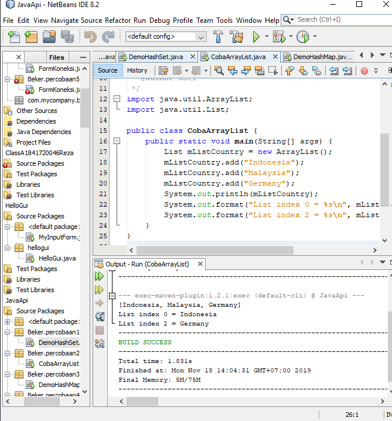
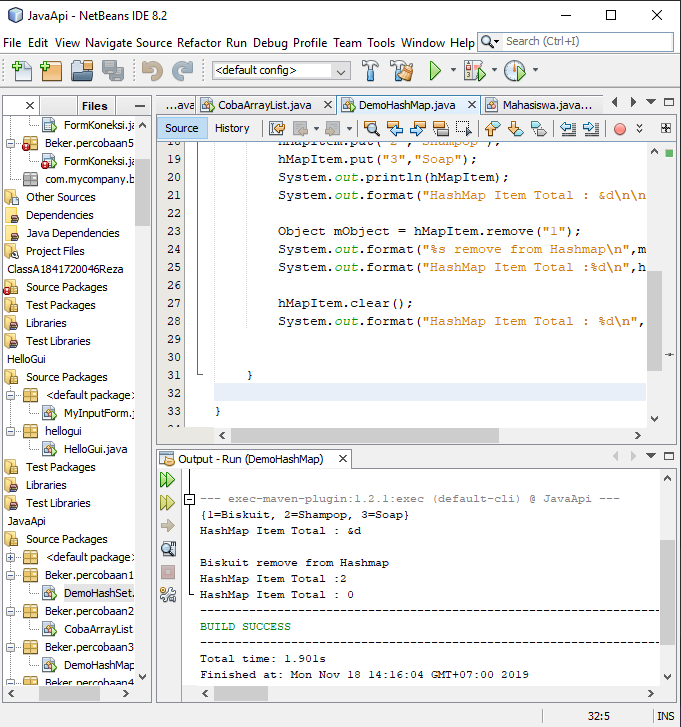
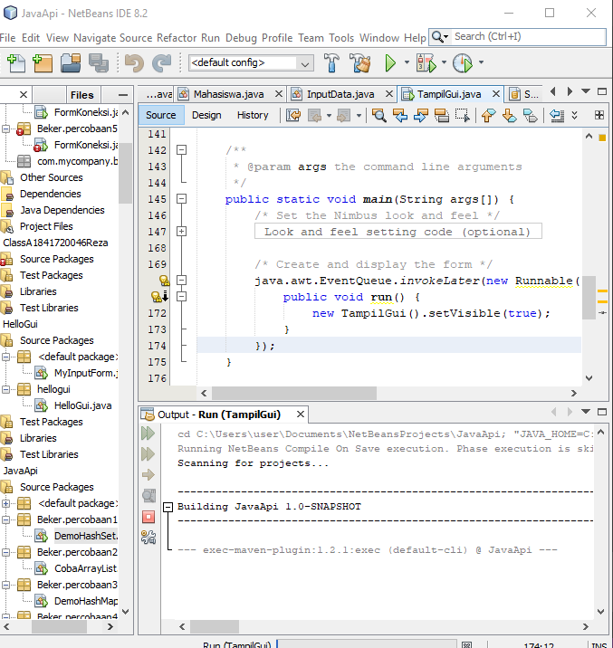
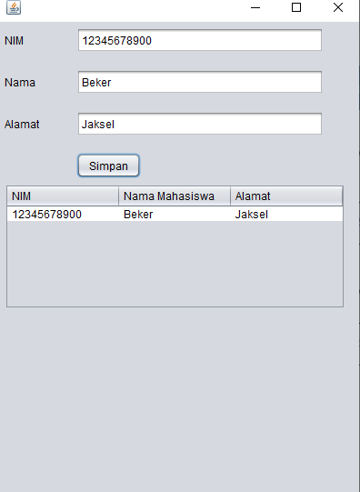

# Laporan Praktikum #12 - Java_API 

## Kompetensi
1. Memahami cara penyimpanan objek menggunakan Collection dan Map. 
2. Mengetahui pengelompokan dari Collection.
3. Mengetahui perbedaan dari interface Set, List dan Map.  Mengetahui penggunaan class-class dari interface Set, List    dan Map.
4. Memahami koneksi database menggunakan JDBC dan JDBC API 

## Ringkasan Materi
Collection adalah suatu objek yang bisa digunakan untuk menyimpan sekumpulan objek. Objek yang ada dalam Collection disebut elemen. Collection menyimpan elemen yang bertipe Object, sehingga berbagai tipe object bisa disimpan dalam Collection. Class-class mengenai Collection tergabung dalam Java Collection Framework. Class-class Collection diletakkan dalam package java.util dan mempunyai dua interface utama yaitu Collection.  
 

 ## Percobaan

 # Percobaan 1
 
 - Class CobaHashSet.java
 Link kode program : [DemoHashSet.java](../../src/12_Java_API/DemoHashSet.java)

 

 ## PERTANYAAN PERCOBAAN 1

1. Apakah fungsi import java.util.*; pada program diatas !
   Jawab :
   Untuk mengimpor semua kelas di dalam java

2. Pada baris program keberapakah yang berfungsi untuk menciptakan object  HashSet? 
   Jawab :
   
  
3. Apakah fungsi potongan program dibawah ini pada percobaan 1! 
   Jawab :
   Untuk mengisi anggota/objek dari suatu Set 
  
4. Tambahkan set.add(“Malang”); kemudian jalankan program! Amati hasilnya    dan jelaskan mengapa terjadi error!
   Jawab :
   Karena pada program tersebut pada baris 26 terdapat fungsi set dimana dia berfungsi untuk menyimpan element-element yang terduplikat. Jadi ketika memanggil nama yang sama, maka yang keluar hanyalah 1 element saja 

5. Jelaskan fungsi potongan program dibawah ini pada percobaan 1
   Jawab :

   # Percobaan 2
   - CobaArrayList.java
   Link kode program : [CobaArrayList.java](../../src/12_Java_API/CobaArrayList.java)

   

## Pertanyaan Percobaan 2
1. Apakah fungsi potongan program dibawah ini!
   Jawab :
   Untuk menampilkan index array yang ke-2 dan nilai index array yang ke-0 

2. Ganti potongan program pada soal no 1 menjadi sebagai berikut
   Kemudian jalankan program tersebut! 
   Jawab :

3. Jelaskan perbedaan menampilkan data pada ArrayList menggunakan            potongan program pada soal no 1 dan no 2!
   Jawab :
   Pada kode pada no.1, hanya menampilkan list country yang dipanggil dari nilai index array yang diminta. Sedangkan kode pada no.2 ,menampilkan seluruh isi dari index array yang ada. 

   # Percobaan 3
   - DemoHashMap.java
   Link kode program : [DemoHashMap.java](../../src/12_Java_API/CobaArrayList.java)

   

## Pertanyaan Percobaan 3

1. Jelaskan fungsi hMapItem.put("1","Biskuit") pada program!

   Jawab : 
   fungsinya yaitu untuk memberikan nilai data pada hashMap.  

2. Jelaskan fungsi hMapItem.size() pada program!

   Jawab :
   untuk menampilkan hasil eksekusi dari data yang sudah di berikan sebelumnya.

3. Jelaskan fungsi hMapItem.remove("1") pada program! 

   Jawab :
   untuk menghapus data Map indeks ke 1

4. Jelaskan fungsi hMapItem.clear() pada program!

   Jawab :
   untuk menghapus semua data yang ada di Map 

5. Tambahkan kode program yang di blok pada program yang sudah anda buat

6. Jalankan program dan amati apa yang terjadi!
   Jawab :

  7. Apakah perbedaan program sebelumnya dan setelah ditambahkan kode          program pada soal no 5 diatas? Jelaskan! 
   Jawab :
    Perbedaannya yaitu pada program sebelumnya dengan program yang baru dia tidak di tampilkan
# Percobaan 4

- Mahasiswa.java

 Link kode program : [Mahasiswa.java](../../src/12_Java_API/Mahasiswa.java)

 - InputData

 Link kode program : [InputData.java](../../src/12_Java_API/InputData.java)

- TampilGui.java

Link kode program : [TampilGui.java](../../src/12_Java_API/TampilGui.java)

# Percobaan 5

## Kesimpulan 

- Saya dapat Memahami cara penyimpanan objek menggunakan Collection dan Map.

- Kita dapat Mengetahui pengelompokan dari Collection.

- Kita dapat  perbedaan dari interface Set, List dan Map.

## Pernyataan Diri

Saya menyatakan isi tugas, kode program, dan laporan praktikum ini dibuat oleh saya sendiri. Saya tidak melakukan plagiasi, kecurangan, menyalin/menggandakan milik orang lain.

Jika saya melakukan plagiasi, kecurangan, atau melanggar hak kekayaan intelektual, saya siap untuk mendapat sanksi atau hukuman sesuai peraturan perundang-undangan yang berlaku.

Ttd,

*(Maulana Reza Pratama)*
