# Laporan Praktikum #14 - GUI dan Database 

## Kompetensi

Setelah menempuh materi percobaan ini, mahasiswa mampu mengenal:

1. Menggunakan paradigma berorientasi objek untuk interaksi dengan database 
2. Membuat backend dan frontend 
3. Membuat form sebagai frontend 
 
## Ringkasan Materi

-  GUI (Graphical User Interface), adalah antarmuka pada sistem operasi atau komputer yang menggunakan menu grafis agar mempermudah para pengguna-nya untuk berinteraksi dengan komputer atau sistem operasi.

-  Jadi, GUI merupakan antarmuka pada sistem operasi komputer yang menggunakan menu grafis. Menu grafis ini maksudnya terdapat tampilan yang lebih ditekankan untuk membuat sistem operasi yang user-friendly agar para pengguna lebih nyaman menggunakan komputer. Menu grafis itu ya seperti ada grafis-grafis atau gambar-gambar dan tampilan yang tujuannya untuk memudahkan para pengguna menggunakan sistem operasi.

## Percobaan

### Percobaan 1

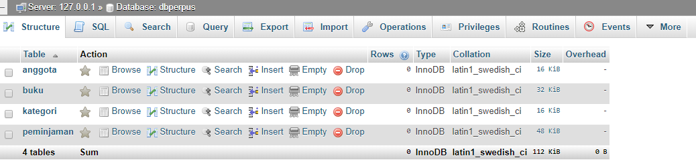

### Percobaan 2

### Percobaan 3

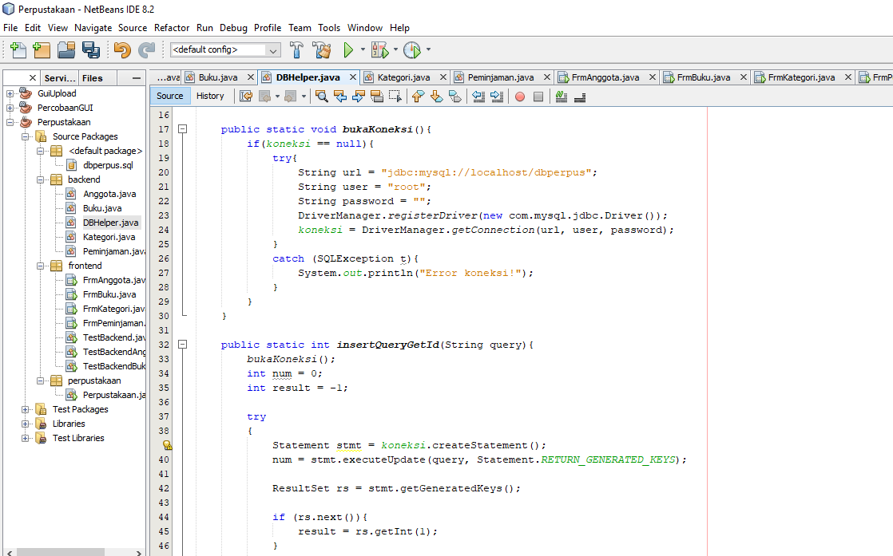

Link kode program: [DBHelper.java](../../src/14_GUI_dan_Database/backend/DBHelper.java)

### Percobaan 4

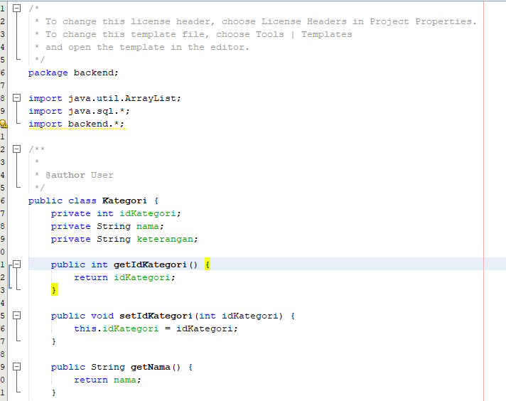

Link kode program: [Kategori.java](../../src/14_GUI_dan_Database/backend/Kategori.java)

### Percobaan 5

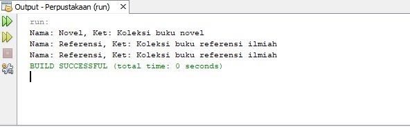

Link kode program: [TestBackend.java](../../src/14_GUI_dan_Database/frontend/TestBackend.java)

### 3.6Percobaan 6

- tambah baru
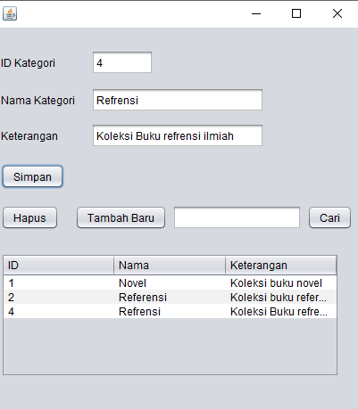

- hapus
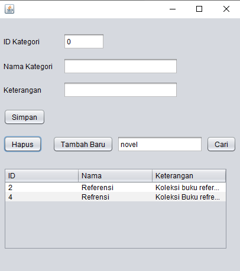

- cari
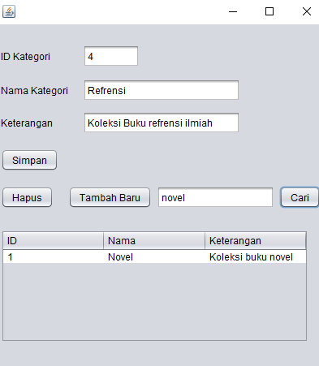 

Link kode program: [FrmKategori.java](../../src/14_GUI_dan_Database/frontend/FrmKategori.java)

### 3.6Percobaan 6

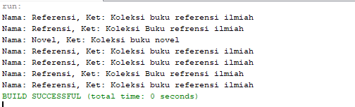

Link kode program: [Anggota.java](../../src/14_GUI_dan_Database/backend/Anggota.java)

### 3.7Percobaan 7

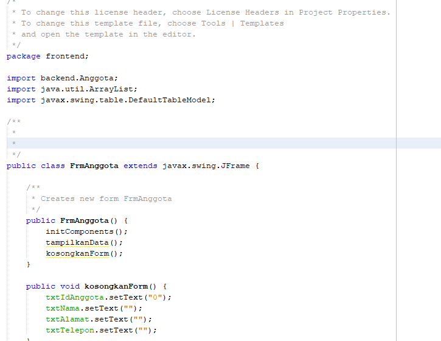

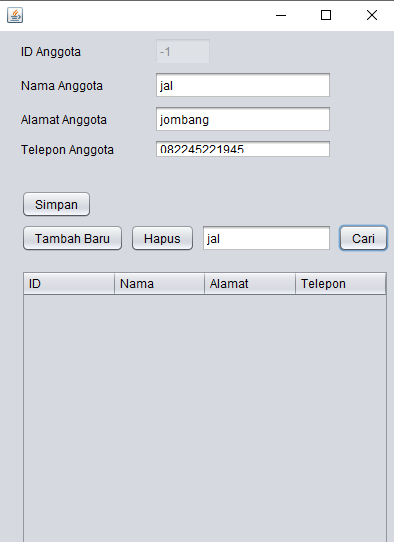

Link kode program: [FrmAnggota.java](../../src/14_GUI_dan_Database/frontend/FrmAnggota.java)

### 3.7Percobaan 7

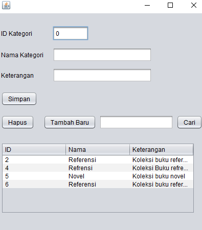

### 3.8Percobaan 8

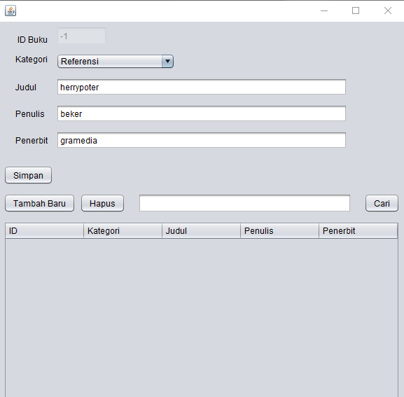

### Tugas

Link kode program: [FrmPeminjaman.java](../../src/14_GUI_dan_Database/frontend/FrmPeminjaman.java)

## Kesimpulan

## Pernyataan Diri

Saya menyatakan isi tugas, kode program, dan laporan praktikum ini dibuat oleh saya sendiri. Saya tidak melakukan plagiasi, kecurangan, menyalin/menggandakan milik orang lain.

Jika saya melakukan plagiasi, kecurangan, atau melanggar hak kekayaan intelektual, saya siap untuk mendapat sanksi atau hukuman sesuai peraturan perundang-undangan yang berlaku.

Ttd,

*(Maulana Reza )*