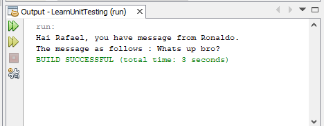
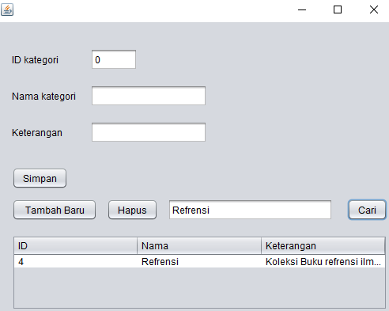
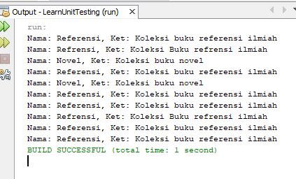

# Laporan Praktikum #15 - Unit Testing 

## Kompetensi

Setelah menyelesaikan lembar kerja ini mahasiswa diharapkan mampu:

1.	Memahami konsep dan fungsi unit testing
2.	Menerapkan unit testing dengan JUnit pada program sederhana.
3.	Menerapkan unit testing dengan JUnit pada progam yang terkoneksi database

## Percobaan

### Percobaan 1

Link kode program : [LearnUnitTesting](../../src/15_Unit_Testing/unittes/LearnUnitTesting.java)

Link kode program : [MessageProcessor](../../src/15_Unit_Testing/unittes/MessageProcessor.java)

### Percobaan 2

Link kode program : [FormKategori](../../src/15_Unit_Testing/unittest/database/FormKategori.java)

Link kode program : [Kategori](../../src/15_Unit_Testing/unittest/database/Kategori.java)

Link kode program : [DBHelper](../../src/15_Unit_Testing/unittest/database/DBHelper.java)

Link kode program : [TestBackend](../../src/15_Unit_Testing/unittest/database/TestBackend.java)

Link kode program : [MessageProcessor](../../src/15_Unit_Testing/test/unittest/MessageProcessor.java)

Link kode program : [TestRunner](../../src/15_Unit_Testing/test/unittest/TestRunner.java)

Link kode program : [Kategori](../../src/15_Unit_Testing/test/unittest/KategorTesti.java)

### TUGAS

Link kode program : [Anggota](../../src/15_Unit_Testing/unittest/anggota/Anggota.java)

Link kode program : [DBHelper](../../src/15_Unit_Testing/unittest/anggota/DBHelper.java)

Link kode program : [FrmAnggota](../../src/15_Unit_Testing/unittest/anggota/FrmAnggota.java)

Link kode program : [TestBackend](../../src/15_Unit_Testing/unittest/anggota/TestBackend.java)

Link kode program : [AnggotaTest](../../src/15_Unit_Testing/test/unittest/anggota/AnggotaTest.java)

## Kesimpulan

1.	Kita dapat memahami konsep dan fungsi unit testing

2.	Kita dapat menerapkan unit testing dengan JUnit pada progam yang terkoneksi database

## Pernyataan Diri

Saya menyatakan isi tugas, kode program, dan laporan praktikum ini dibuat oleh saya sendiri. Saya tidak melakukan plagiasi, kecurangan, menyalin/menggandakan milik orang lain.

Jika saya melakukan plagiasi, kecurangan, atau melanggar hak kekayaan intelektual, saya siap untuk mendapat sanksi atau hukuman sesuai peraturan perundang-undangan yang berlaku.

Ttd,

*(Maulana Reza Pratama)*