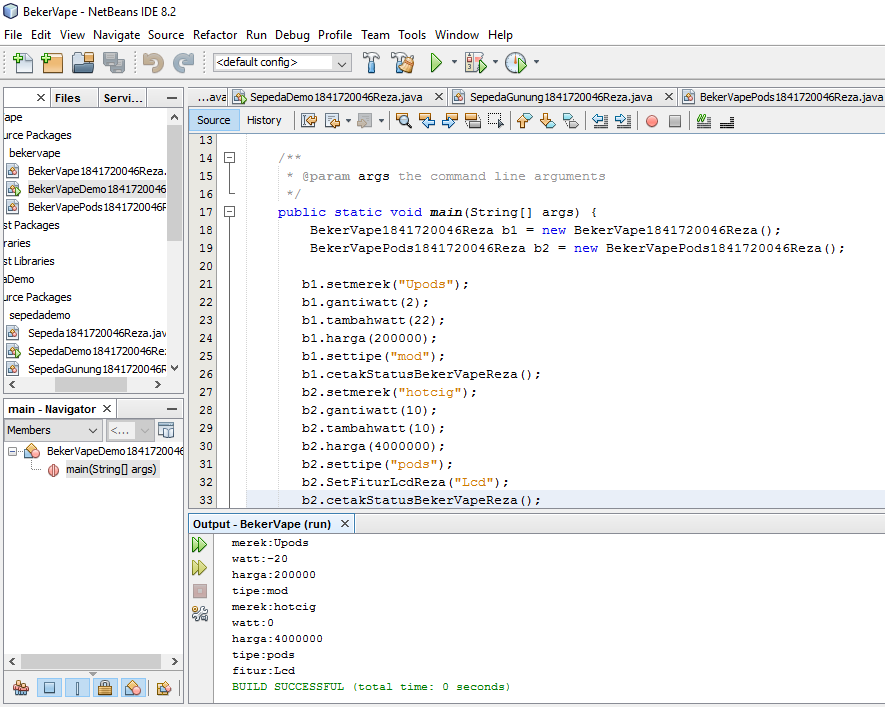

# Laporan Praktikum #1 - Pengantar Konsep PBO

## Kompetensi

(ketiklah kompetensi tiap praktikum di sini)

## Ringkasan Materi

(Setelah menempuh materi percobaan ini, mahasiswa mampu mengenal:
1. Perbedaan paradigma berorientasi objek dengan paradigma struktural
2. Konsep dasar PBO

## Percobaan

### Percobaan 1
Penjelasan : Kita mengetahui penambahan dan pengurangan kecepatan.

Contoh link kode program : [ini contoh link ke kode program](../../src/1_Pengantar_Konsep_PBO/Sepeda1841720046Reza.java)

### Percobaan 2

Penjelasan : Kita mengetahui turunan dari sifat dari induk yaitu Sepeda ke anaknya yaitu SepedaGunung.

Contoh link kode program : [ini contoh link ke kode program](../../src/1_Pengantar_Konsep_PBO/SepedaDemo1841720046Reza.java)

## Pertanyaan

1. Sebutkan dan jelaskan aspek-aspek yang ada pada pemrograman berorientasi objek!

2. Apa yang dimaksud dengan object dan apa bedanya dengan class?

3. Sebutkan salah satu kelebihan utama dari pemrograman berorientasi objek dibandingkan
dengan pemrograman struktural!
4. Pada class Sepeda, terdapat state/atribut apa saja?
5. Tambahkan atribut warna pada class Sepeda.
6. Mengapa pada saat kita membuat class SepedaGunung, kita tidak perlu membuat class nya dari
nol?

## Jawaban
1. a. Object adalah suatu rangkaian dalam program yang terdiri dari state dan behaviour. 
 
    b. Class adalah blueprint atau prototype dari objek. Ambil contoh objek sepeda. Terdapat berbagai
macam sepeda di dunia, dari berbagai merk dan model

    c. Enkapsulasi Disebut juga dengan information-hiding. Dalam berinteraksi dengan objek, seringkali kita tidak
perlu mengetahui kompleksitas yang ada didalamnya

    d. Inheritence Disebut juga pewarisan. Inheritance memungkinkan kita untuk mengorganisir struktur program
dengan natura

    e. Polimorfisme Polimorfisme juga meniru sifat objek di dunia nyata, dimana sebuah objek dapat memiliki
bentuk, atau menjelma menjadi bentuk-bentuk lain

2. Object adalah suatu rangkaian dalam program yang terdiri dari state dan behaviour. 
   Class adalah blueprint atau prototype dari objek
   
3. Dalam menggunakan sebuah class cukup sekali tidak perlu dituis berkali-kali.
   Dapat menambahkan fitur pada class tanpa mengedit class asal.
   Menggunakan objek tanpa harus tahu teknis yang ada didalamnya.
   
4. Merek , Kecepatan Gear

5. 

6. 

## Tugas
1. Buatlah program yang merupakan class dari objek yang ada dunia nyata sesuai dengan imajinasi
anda. Silahkan merujuk pada kode program praktikum yang sudah kita lakukan sebelumnya
untuk sintak-sintak nya.

Contoh link kode program : [ini contoh link ke kode program](../../src/1_Pengantar_Konsep_PBO/BekerVapeDemo1841720046.java)

Contoh link kode program : [ini contoh link ke kode program](../../src/1_Pengantar_Konsep_PBO/BekerVape1841720046Reza.java)

Contoh link kode program : [ini contoh link ke kode program](../../src/1_Pengantar_Konsep_PBO/BekerVapePods1841720046Reza.java)

## Kesimpulan

(kita dapat mendemonstrasikan bagaimana cara pemrograman beorentasi objek dapat dibuat secara sederhana )

## Pernyataan Diri

Saya menyatakan isi tugas, kode program, dan laporan praktikum ini dibuat oleh saya sendiri. Saya tidak melakukan plagiasi, kecurangan, menyalin/menggandakan milik orang lain.

Jika saya melakukan plagiasi, kecurangan, atau melanggar hak kekayaan intelektual, saya siap untuk mendapat sanksi atau hukuman sesuai peraturan perundang-undangan yang berlaku.

Ttd,

***(Maulana Reza Pratama)***
