# Laporan Praktikum #7 - OVERLOADING DAN OVERRIDING

## Kompetensi
Setelah menempuh pokok bahasan ini, mahasiswa mampu : 

a. Memahami konsep overloading dan overriding, 
b. Memahami perbedaan overloading dan overriding, 
c. Ketepatan dalam mengidentifikasi method overriding dan overloading 
d. Ketepatan dalam mempraktekkan instruksi pada jobsheet 
e. Mengimplementasikan method overloading dan overriding

## Ringkasan Materi

- Overloading adalah menuliskan kembali method dengan nama yang sama pada suatu class. Tujuannya dapat 
  memudahkan penggunaan/pemanggilan method dengan fungsionalitas yang mirip

- Perbedaan daftar parameter bukan hanya terjadi pada perbedaan banyaknya parameter, tetapi juga urutan darai parameter tersebut

- Overriding adalah Sublass yang berusaha memodifkasi tingkah laku yang diwarisi dari superclass. 
  Tujuannya subclass dapat memiliki tingkah laku yang lebih spesifik sehingga dapat dilakukan 
  dengan cara mendeklarasikan kembali method milik parent class di subclass. 

- Overriding method tidak boleh throw checked exceptions yang tidak dideklarasikan oleh overridden method. 

## Percobaan

### Percobaan 1

-Class Karyawan1841720046Reza.java

Link kode program : [Karyawan1841720046Reza.java](../../src/7_Overriding_dan_Overloading/Karyawan1841720046Reza.java)

- Class Manager1841720046Reza

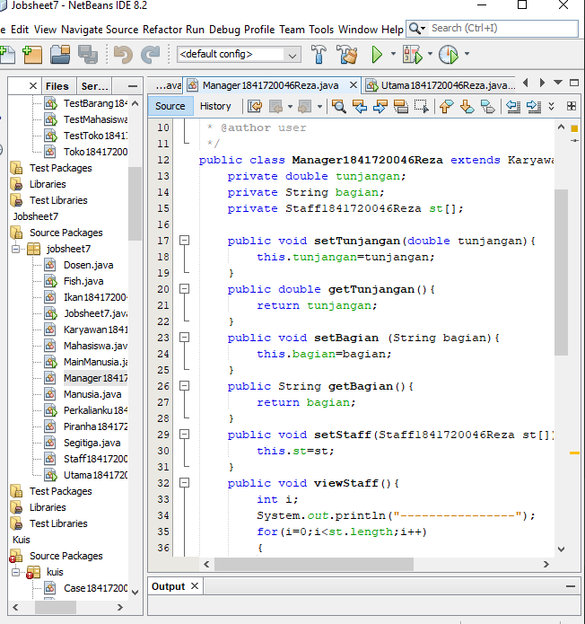

Link kode program :
[Manager1841720046Reza.java](../../src/7_Overriding_dan_Overloading/Manager1841720046Reza.java)

Link kode program :

- Class Staff1841720046Reza

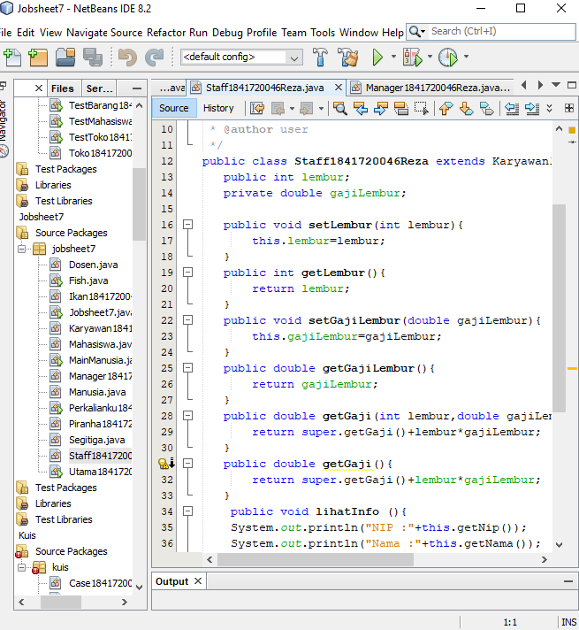

Link kode program :
[Staff1841720046Reza.java](../../src/7_Overriding_dan_Overloading/Staff1841720046Reza.java)

- ClassUtama 1841720046Reza.java

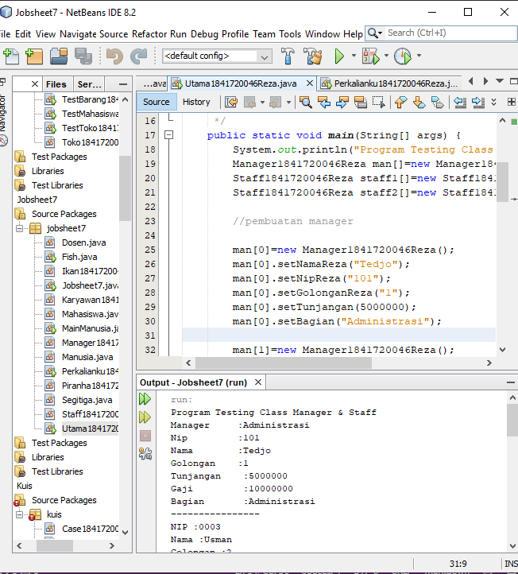

Link kode program :
[Utama1841720046Reza.java](../../src/7_Overriding_dan_Overloading/Utama1841720046Reza.java)

### Latihan

Class Perkalianku1841720046Reza

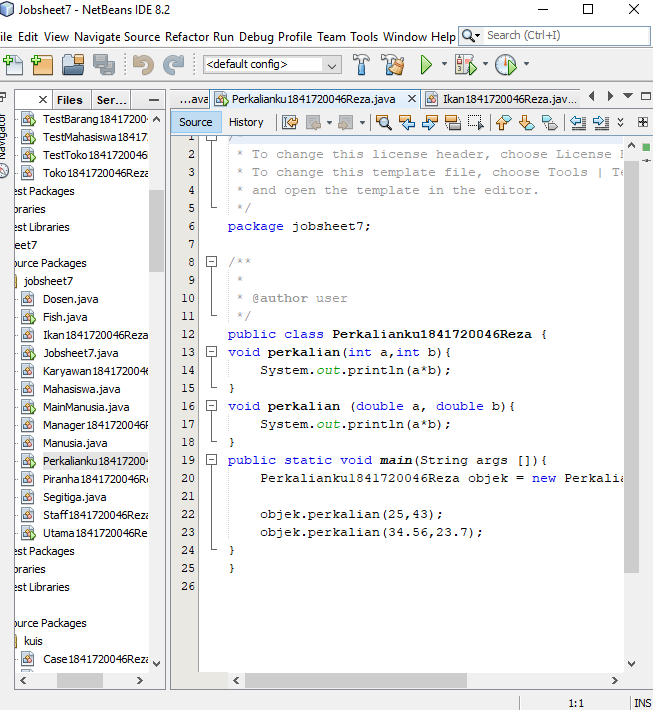

Link kode program :
[Perkalianku1841720046Reza.java](../../src/7_Overriding_dan_Overloading/Perkalianku1841720046Reza.java)

4. 1 Dari source coding diatas terletak dimanakah overloading?
- Pada objek.perkalian karena jumlah parameternya berbeda

4. 2 Jika terdapat overloading ada berapa jumlah parameter yang berbeda?
- 2 tipe parameter dengan jumlah parameter yang berbeda yaitu 2 dan 3    

Class Perkalianku21841720046Reza

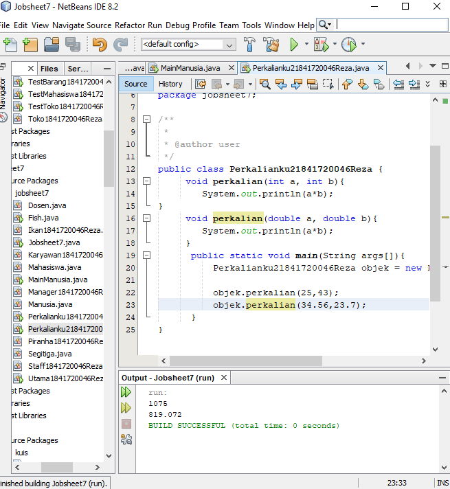

Link kode program :
[Perkalianku21841720046Reza.java](../../src/7_Overriding_dan_Overloading/Perkalianku21841720046Reza.java)

4. 3 Dari source coding diatas terletak dimanakah overloading?
- pada objek.perkalian karena parameternya berbeda

4. 4 Jika terdapat overloading ada berapa tipe parameter yang berbeda?
- 2 tipe parameter yaitu tipe double dan tipe integer

Class Fish1841720046Reza

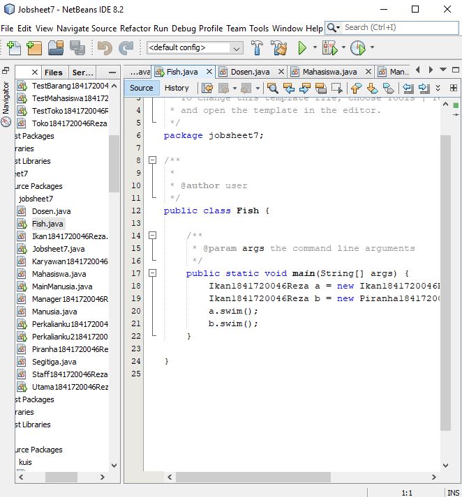

Link kode program :
[Fish1841720046Reza.java](../../src/7_Overriding_dan_Overloading/Fish1841720046Reza.java)

4. 5 Dari source coding diatas terletak dimanakah overriding?
- Terletak pada class Piranha1841720046Reza

4. 6 Jabarkanlah apabila sourcoding diatas jika terdapat overriding?
- 1.pada class Ikan1841720046Reza dan class Piranha1841720046Reza memiliki method nama yang sama

2.class Piranha merupakan subclass dari classIkan1841720046Reza
3.Mode akses overidding method swimReza()

## Tugas

### Overloading

- Class Segitiga

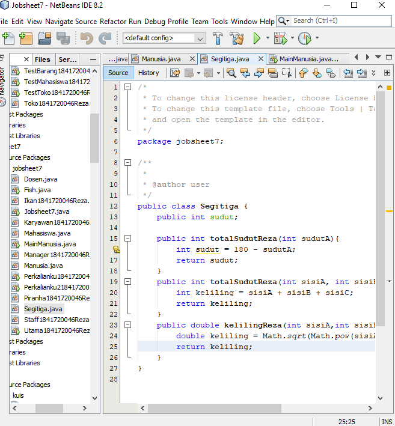

Link kode program :
[Segitiga.java](../../src/7_Overriding_dan_Overloading/Segitiga.java)

### Overriding

- Class Manusia
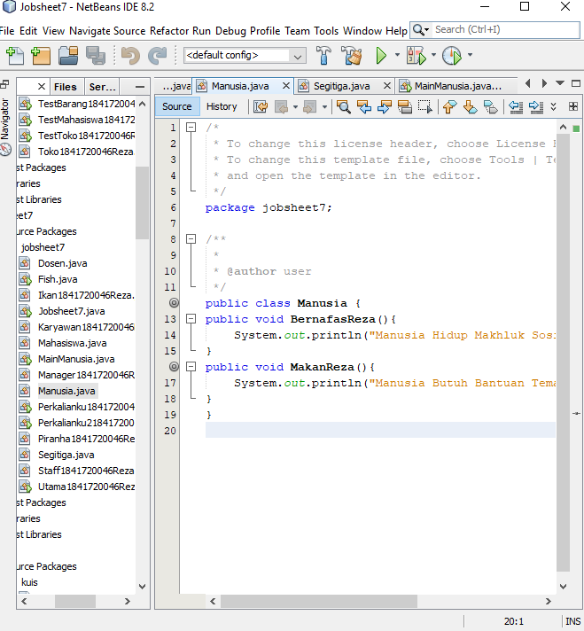

Link kode program :
[Manusia.java](../../src/7_Overriding_dan_Overloading/Manusia.java)

- Class Dosen

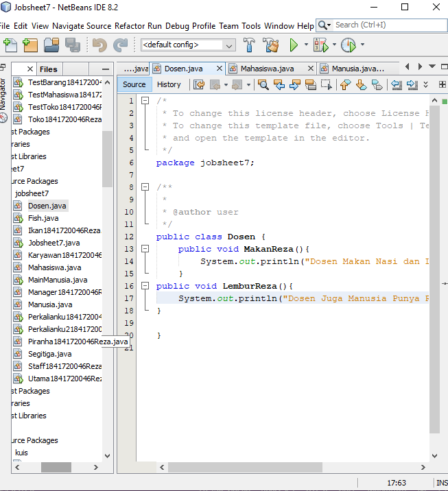

Link kode program :
[dosen.java](../../src/7_Overriding_dan_Overloading/Manusia.java)

- class Mahasiswa
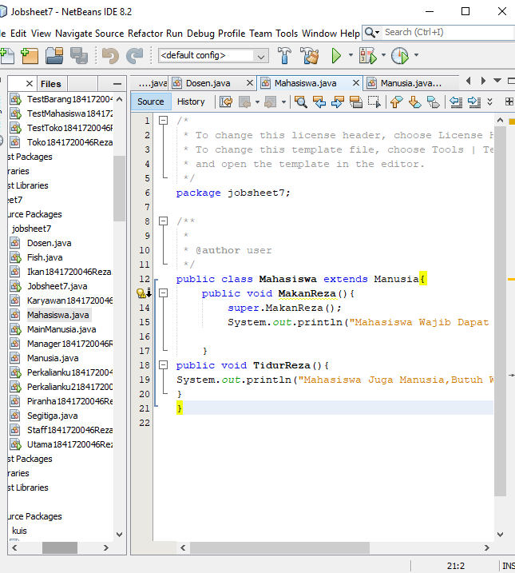

Link kode program :
[Mahasiswa.java](../../src/7_Overriding_dan_Overloading/Mahasiswa.java)

- class MainManusia
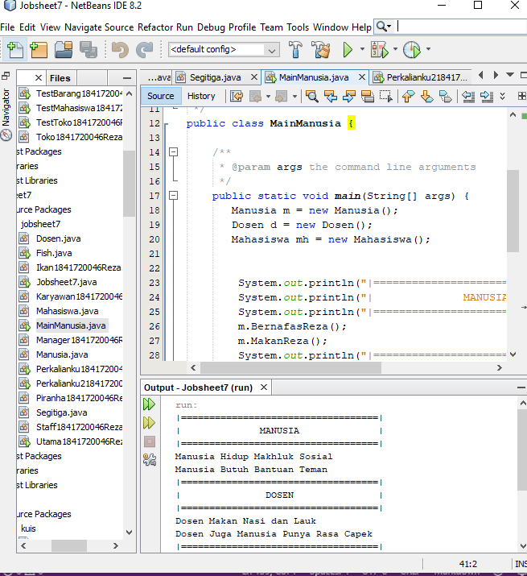

Link kode program :
[MainManusia.java](../../src/7_Overriding_dan_Overloading/MainManusia.java)

# Kesimpulan

a.    Kita dapat memahami konsep overloading dan overriding,

b.    Kita dapat memahami perbedaan overloading dan overriding,

c.    Kita dapat mengidentifikasi method overriding dan overloading

d.    Kita dapat mengimplementasikan method overloading dan overriding.

## Pernyataan Diri

Saya menyatakan isi tugas, kode program, dan laporan praktikum ini dibuat oleh saya sendiri. Saya tidak melakukan plagiasi, kecurangan, menyalin/menggandakan milik orang lain.

Jika saya melakukan plagiasi, kecurangan, atau melanggar hak kekayaan intelektual, saya siap untuk mendapat sanksi atau hukuman sesuai peraturan perundang-undangan yang berlaku.

Ttd,

*(Maulana Reza Pratama)*